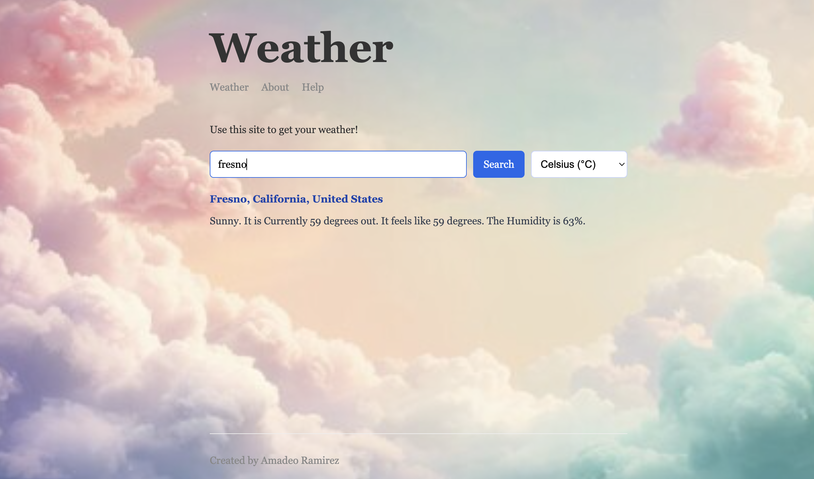

# **Weather App**
This site was created by Amadeo Ramirez.

I’m a tech apprentice at Road to Hire, pushing myself to thrive in their coding program while simultaneously learning how to navigate the professional corporate world. I came into this with no prior coding experience—my background is in International Studies—but I realized that the world is constantly changing, and I wanted to adapt by learning a skill that’s shaping the future.

Right now, I’m diving into both front-end and back-end development, exploring how they work together to create seamless and engaging user experiences. I’m excited to experiment, learn, and see where this journey can take me!
## Hosted site link
Check it out here!

---
##  The Contributor
